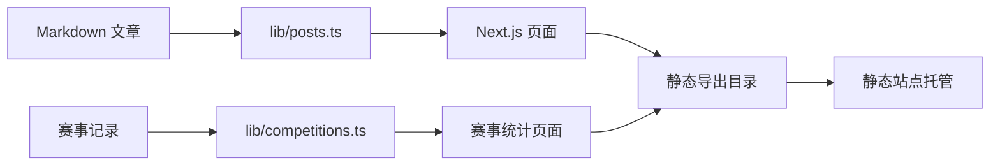

# 敖胤AI 架构

## 概述

敖胤AI是一个以 Markdown 内容为数据源的静态 AI 博客。网站提供文章、栏目、标签、归档、搜索、RSS、学习路线图、赛事统计和社区导航页面。

应用采用 Next.js App Router 构建，并通过静态导出生成可部署文件。运行时不依赖数据库或自建 API；文章和赛事数据在构建期读取并渲染为静态页面。

## 技术栈

- TypeScript 与 React 18
- Next.js 14 App Router
- Tailwind CSS 3
- Gray Matter 解析文章 Front Matter
- Remark、Rehype 和 Shiki 渲染 Markdown 与代码块
- Framer Motion 提供部分交互动画

## 项目结构

```text
app/                 页面路由、根布局和全局样式
components/          可复用页面组件
content/posts/       Markdown 文章与 Front Matter
lib/                 内容、站点、分类、RSS 和赛事数据模块
scripts/postbuild.js 静态 sitemap 与 robots 生成脚本
public/              静态图片与资源
```

## 子系统

### 内容系统

- 位置：`content/posts/`、`lib/posts.ts`
- 责任：读取 Markdown、解析 Front Matter、按日期排序、按栏目或标签过滤，并将 Markdown 转换为 HTML。

### 页面与导航系统

- 位置：`app/`、`components/`
- 责任：通过 App Router 生成静态路由；根布局注入站点元数据、主题脚本、导航和页脚。

### 赛事统计系统

- 位置：`app/stats/page.tsx`、`components/StatsPageContent.tsx`、`lib/competitions.ts`
- 责任：维护赛事快照、来源、关键日期和追加式更新记录；派生活跃与归档赛事、奖金及时间轴；统计页面展示桌面双栏时间轴和移动端单栏内容。

### 搜索与发现系统

- 位置：`app/search/page.tsx`、`components/SearchClient.tsx`、`lib/rss.ts`、`lib/sitemap.ts`
- 责任：提供客户端文章搜索、RSS 输出和构建时 sitemap 生成。

## 数据流



## 构建流程

`npm run build` 执行 Next.js 生产构建和 `scripts/postbuild.js`。Next.js 配置启用 `output: 'export'`，并关闭图片优化以适配静态托管。
