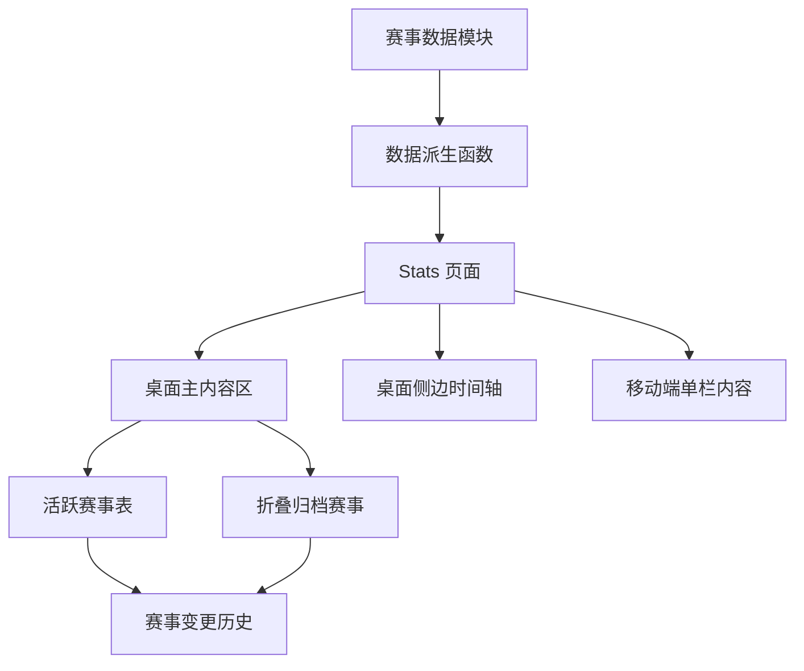

# AI 赛事统计页布局与赛事数据历史

Feature Name: 2026-07-21-ai-competition-stats-layout
Updated: 2026-07-21

## Description

本设计将 `/stats` 重组为以活跃赛事为核心的双栏页面：桌面端主栏承载概览、奖金比较、赛道筛选和赛事表，侧栏提供粘性关键时间轴；移动端按单栏顺序显示。赛事数据从页面组件迁移到独立模块，并以追加式更新记录保存字段变更。归档赛事默认折叠，读者可在当前页面查看历史列表和每场赛事的完整变更记录。

## Architecture



`lib/competitions.ts` 是赛事信息的唯一维护入口。该模块定义原始赛事记录、追加式更新记录和关键日期；派生函数在渲染前计算有效字段、活跃赛事、归档赛事、奖金数据和时间轴节点。`app/stats/page.tsx` 只组合页面区块与展示组件，避免数据事实分散在页面 JSX 中。

## Components and Interfaces

### 赛事数据模块

新增 `lib/competitions.ts`，导出以下类型和数据：

```ts
export type CompetitionStatus = '报名中' | '待核验' | '已截止' | '已结束'

export type CompetitionChange = {
  date: string
  summary: string
  sourceUrl: string
  changes: Partial<CompetitionSnapshot>
}

export type CompetitionSnapshot = {
  name: string
  category: string
  prize: number | null
  prizeUnit: string
  status: CompetitionStatus
  deadline: string | null
  sourceUrl: string
}

export type CompetitionRecord = CompetitionSnapshot & {
  id: string
  verifiedAt: string
  changes: CompetitionChange[]
}
```

- `competitionRecords` 保存赛事初始快照和更新记录，新增赛事以新 `id` 追加。
- `resolveCompetition(record)` 按日期顺序应用 `changes`，返回页面展示的最新有效快照。
- `getActiveCompetitions(asOf)` 返回已核验、具有来源和截止日期、且截止日期不早于 `asOf` 的记录。
- `getArchivedCompetitions(asOf)` 返回截止日期早于 `asOf` 的记录。
- `getTimelineItems(records)` 提取活跃赛事的截止、公布、决赛和颁奖节点并升序排列。

### Stats 页面

`app/stats/page.tsx` 保持 Server Component，使用数据模块提供的派生结果。

- 顶部展示数据核验日期、活跃赛事数和已公开奖金总额。
- `lg` 及以上断点使用 12 列网格：主栏占 8 列，侧栏占 4 列。
- 侧栏时间轴使用 `sticky top-24`，高度超过视口时使用独立纵向滚动区域。
- `lg` 以下将时间轴移至赛事详情表之前，页面保持单栏阅读顺序。
- 活跃赛事表中每行提供来源链接、状态标签和原生 `details/summary` 变更记录展开控件。
- 归档区使用原生 `details/summary`，默认关闭，内部表格复用赛事行展示。

### 时间轴

时间轴节点模型：

```ts
type TimelineItem = {
  id: string
  competitionId: string
  date: string
  label: string
  type: 'deadline' | 'result' | 'final' | 'award'
}
```

时间轴仅呈现活跃赛事的未来节点。每项节点链接到对应赛事行锚点，确保侧栏信息可直接定位到赛事详情。

## Data Models

### 追加式更新规则

每个赛事拥有稳定的 `id`。赛事日期、奖金、状态、名称或来源变更时，维护者向 `changes` 数组追加一条记录；旧快照和旧变更保持原样。页面通过 `resolveCompetition` 显示最新字段，展开区域按时间倒序显示全部更新。

| 场景 | 数据操作 | 页面结果 |
| --- | --- | --- |
| 发现新赛事 | 追加 `CompetitionRecord` | 加入活跃赛事表与时间轴 |
| 截止日期变更 | 追加含 `deadline` 的 `CompetitionChange` | 表格和时间轴使用新日期 |
| 奖金调整 | 追加含 `prize` 的 `CompetitionChange` | 奖金图与统计使用新金额 |
| 赛事截止 | 追加含归档状态的 `CompetitionChange` | 赛事移入折叠归档区 |
| 来源待确认 | 追加含待核验状态的 `CompetitionChange` | 赛事留在数据集中并排除活跃统计 |

## Correctness Properties

1. 每个 `CompetitionRecord.id` 在 `competitionRecords` 中唯一。
2. 每条 `CompetitionChange.date` 晚于或等于赛事记录的初始核验日期。
3. 页面展示字段来自初始快照及按日期排序后最后一个有效变更。
4. 活跃赛事同时具有有效来源、有效截止日期和“报名中”状态。
5. 归档赛事保留初始快照与全部变更记录。
6. 时间轴日期按升序排列，且每个节点关联一个活跃赛事记录。
7. 奖金总额只累加活跃赛事中已公开的数值金额。

## Error Handling

- 缺少来源链接的赛事显示“待核验”，并从活跃统计、奖金图和时间轴排除。
- 无法解析的日期显示“日期待核验”，并从基于日期的派生集合排除。
- 缺少奖金信息的赛事显示“未公开”，奖金比较区跳过该记录。
- 赛事更新记录包含未知字段时，TypeScript 类型检查阻止构建通过。

## Test Strategy

1. 为 `resolveCompetition` 编写单元测试，验证追加状态、奖金和截止日期更新后的最终快照。
2. 为活跃和归档派生函数编写日期边界测试，覆盖截止当日、截止次日、待核验和缺少来源的记录。
3. 为时间轴派生函数编写排序和过滤测试，覆盖多日期、多赛事和已归档赛事。
4. 为 `/stats` 增加渲染测试，验证活跃赛事数量、折叠归档区、变更历史和来源链接。
5. 执行 `npm run build`，验证静态导出、类型检查和页面生成。

## References

[^1]: (`app/stats/page.tsx#L10`) - 当前赛事统计页的内联赛事数据、时间轴和表格实现。
[^2]: (`content/posts/ai-competitions-2026.md#L1`) - 当前赛事汇总文章和赛事来源说明。
[^3]: (https://www.datafountain.cn/competitions) - DataFountain 赛事平台，用于核验可报名赛事。
[^4]: (https://opc.aliyun.com/xiaoyoukewei?display_mode=3) - 阿里云“小有可为”赛事官方赛程。
