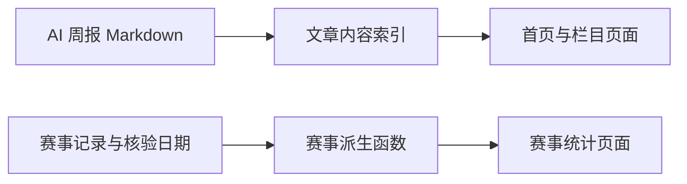

# AI 内容与赛事数据刷新

Feature Name: ai-content-and-competition-refresh
Updated: 2026-08-02

## Description

本次刷新通过新增一篇 Markdown 周报覆盖全部站点栏目，并复用赛事数据模块的日期派生逻辑更新统计页面。

## Architecture

## Components and Interfaces

- `content/posts/ai-weekly-august-2026.md` 使用全部栏目 slug，使已有首页、栏目、搜索、归档和 RSS 逻辑自动收录。
- `lib/competitions.ts` 更新唯一的赛事核验日期常量；活跃和归档赛事继续由现有 `getActiveCompetitions` 与 `getArchivedCompetitions` 派生。

## Correctness Properties

- 新文章日期为 2026-08-02，且关联的栏目 slug 均存在于栏目元数据中。
- 截止日期早于核验日期的赛事不会计入可报名赛事统计。
- 赛事来源链接保持 HTTP 或 HTTPS 格式。

## Test Strategy

- 运行赛事数据单测，验证活跃、归档和时间轴派生规则。
- 运行生产构建，验证文章 Front Matter、静态路由与赛事页面渲染。
