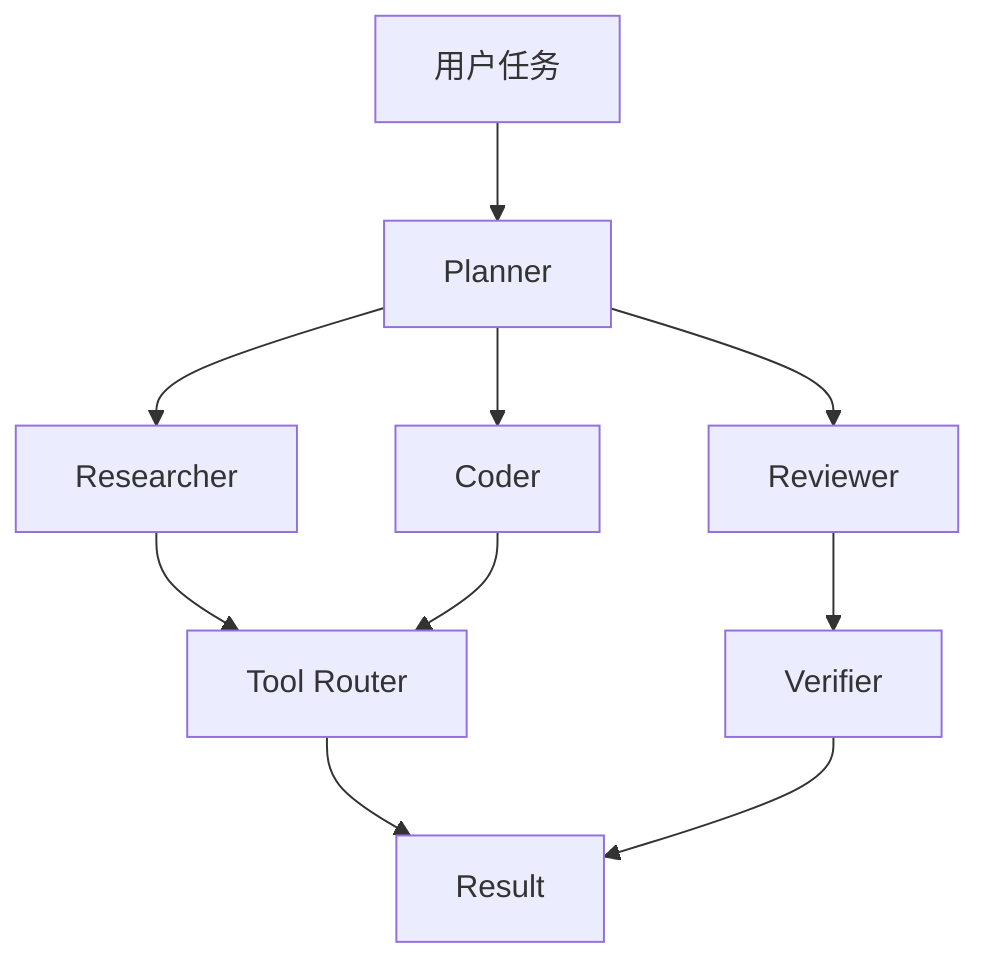

## 项目初衷

在大模型 + Agent 时代，单 Agent 的能力上限受到工具调用、上下文长度、任务复杂度的多重约束。**T-agent** 探索"任务分解 + 角色分工 + 协同验证"的多智能体范式。

## 核心特性

- **角色定义（Role）**：用 DSL 描述 Agent 身份与能力
- **任务编排（Plan）**：自动拆解 + 动态调整
- **通信协议（Comm）**：结构化消息总线
- **可观测性（Trace）**：完整可视化执行轨迹

## 架构概览

## 路线图

- [x] v0.1 单智能体 + 工具调用
- [x] v0.2 多智能体协作
- [ ] v0.3 长期记忆与用户偏好
- [ ] v0.4 可视化 Studio
- [ ] v1.0 完整企业级特性

## 开源计划

源码会持续在 GitHub 公开，欢迎贡献 issue、PR 和新角色模板。

> 下一篇文章会写《T-agent 的角色设计与提示词工程实践》。
